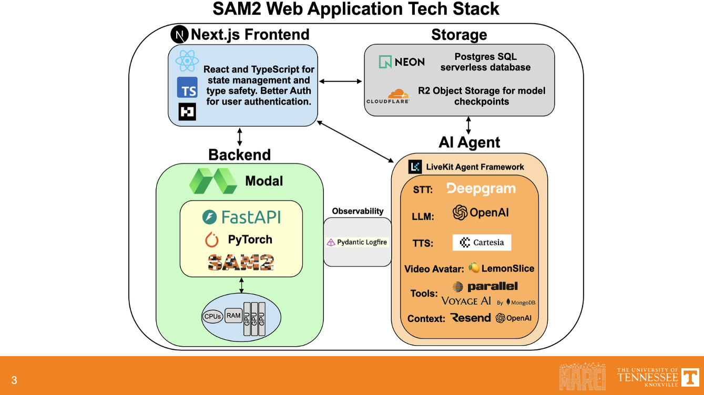

<div align="center">

# SAM 2 No-Code Fine-Tuning Platform

### Train Meta's Segment Anything Model 2 on your own data — no code required.

[](https://nextjs.org/)
[](https://react.dev/)
[](https://www.typescriptlang.org/)
[](https://pytorch.org/)
[](https://modal.com/)
[](https://tailwindcss.com/)

<br />

[**Launch App**](https://nocodefinetuning.calvinwetzel.dev/) · [**LinkedIn**](https://www.linkedin.com/in/calvinwetzel/) · [**Report Bug**](https://github.com/czhurdlespeed/sam2finetuning/issues)

<br />

---

</div>

<br />

## Demo

<div align="center">

<!-- ╔══════════════════════════════════════════════════════════════╗ -->
<!-- ║  Replace the block below with your video embed when ready  ║ -->
<!-- ║  Example: [](https://youtu.be/...)   ║ -->
<!-- ╚══════════════════════════════════════════════════════════════╝ -->

<table>
  <tr>
    <td align="center" width="640" height="360" style="background-color:#1a1a2e; border-radius:12px;">
      <br /><br /><br />
      
      <br /><br /><br /><br />
    </td>
  </tr>
</table>

</div>

<br />

---

## What It Does

Fine-tuning SAM 2 traditionally requires deep knowledge of PyTorch, distributed training, Hydra configs, and cloud GPU orchestration. **This platform removes all of that friction.**

Through a clean web interface, users can:

- **Authenticate** via GitHub or Google OAuth
- **Configure** training runs — choose LoRA rank, model checkpoint size, target dataset, and epoch count
- **Launch** GPU-accelerated training on Modal Labs with a single click
- **Monitor** progress through real-time streaming logs (Server-Sent Events)
- **Download** fine-tuned checkpoints directly from Cloudflare R2 storage

The result: **production-quality SAM 2 fine-tuning, accessible to anyone with a browser.**

<br />

---

## Architecture & Tech Stack

<div align="center">



<br />
<sub><i>System architecture showing the full data flow from frontend to GPU training and back</i></sub>

</div>

<br />

### Why These Technologies?

<table>
  <thead>
    <tr>
      <th>Layer</th>
      <th>Technology</th>
      <th>Why It Matters</th>
    </tr>
  </thead>
  <tbody>
    <tr>
      <td rowspan="4"><strong>Frontend</strong></td>
      <td>Next.js 16 + React 19</td>
      <td>Server Components and the App Router enable API routes, SSE streaming, and UI to coexist in one deployment — no separate backend server needed for the web layer</td>
    </tr>
    <tr>
      <td>TypeScript 5</td>
      <td>End-to-end type safety from database schema (Drizzle) through API routes to React components, catching bugs at compile time</td>
    </tr>
    <tr>
      <td>Tailwind CSS 4 + Material UI 7</td>
      <td>Rapid, consistent styling with MUI's component library for complex UI elements like training configuration forms</td>
    </tr>
    <tr>
      <td>Drizzle ORM</td>
      <td>Type-safe SQL with zero overhead — generates migrations from TypeScript schema, keeping the DB in sync without heavy ORM abstractions</td>
    </tr>
    <tr>
      <td rowspan="3"><strong>ML Backend</strong></td>
      <td>PyTorch 2.5+ / SAM 2</td>
      <td>Meta's state-of-the-art segmentation model, fine-tuned with LoRA adapters to minimize compute while preserving quality</td>
    </tr>
    <tr>
      <td>Hydra Configs</td>
      <td>Declarative, composable training configurations — each combination of model size, dataset, and hyperparameters maps to a clean YAML override</td>
    </tr>
    <tr>
      <td>FastAPI</td>
      <td>Lightweight Python API layer that bridges the Next.js frontend to the PyTorch training loop, handling job dispatch and webhook callbacks</td>
    </tr>
    <tr>
      <td rowspan="4"><strong>Infrastructure</strong></td>
      <td>Modal Labs</td>
      <td>Serverless GPU compute — pay only for training time with zero cold-start provisioning of A100/H100 hardware. No GPU clusters to manage</td>
    </tr>
    <tr>
      <td>Vercel</td>
      <td>Zero-config deployment for the Next.js app with edge functions, automatic HTTPS, and preview deployments on every PR</td>
    </tr>
    <tr>
      <td>Neon PostgreSQL</td>
      <td>Serverless Postgres that scales to zero — perfect for bursty workloads where training jobs may be hours apart</td>
    </tr>
    <tr>
      <td>Cloudflare R2</td>
      <td>S3-compatible object storage with zero egress fees — critical when users download multi-GB checkpoint files</td>
    </tr>
    <tr>
      <td rowspan="2"><strong>AI Agent</strong></td>
      <td>LiveKit + OpenAI</td>
      <td>Real-time voice agent integration powered by LiveKit's WebRTC infrastructure, enabling conversational interaction with the training platform</td>
    </tr>
    <tr>
      <td>Deepgram + Cartesia</td>
      <td>Speech-to-text and text-to-speech pipeline for natural voice interactions — Deepgram for low-latency transcription, Cartesia for expressive speech synthesis</td>
    </tr>
    <tr>
      <td rowspan="2"><strong>Auth & Ops</strong></td>
      <td>Better-Auth</td>
      <td>Lightweight OAuth framework supporting GitHub and Google — admin approval gate ensures only authorized users can launch GPU training jobs</td>
    </tr>
    <tr>
      <td>Logfire</td>
      <td>Observability for the training pipeline — trace job submissions, monitor Modal webhook callbacks, and debug SSE streaming issues</td>
    </tr>
  </tbody>
</table>

<br />

---

## How It Works

```
  Authenticate          Configure             Train                Monitor             Download
 ┌───────────┐     ┌──────────────┐     ┌──────────────┐     ┌──────────────┐     ┌────────────┐
 │  GitHub /  │────>│  LoRA Rank   │────>│  Modal Labs  │────>│  Real-time   │────>│ Checkpoint │
 │  Google    │     │  Model Size  │     │  Serverless  │     │  SSE Logs    │     │ from R2    │
 │  OAuth     │     │  Dataset     │     │  GPU (A100)  │     │              │     │            │
 └───────────┘     │  Epochs      │     └──────────────┘     └──────────────┘     └────────────┘
                   └──────────────┘
```

1. **Sign in** with GitHub or Google — an admin approves your account for training access
2. **Pick your parameters** — LoRA rank (2/4/8/16/32), checkpoint size (tiny/small/base+/large), dataset, and epoch count
3. **Hit train** — the app submits a job to Modal Labs, which spins up a GPU instance and begins fine-tuning
4. **Watch it run** — logs stream back to your browser in real-time via Server-Sent Events
5. **Grab your model** — once training completes, Modal uploads the checkpoint to R2 and you download it instantly

<br />

---

## Repository Structure

This project is organized as a **monorepo with three git submodules**, each handling a distinct concern:

```
sam2finetuning/
├── sam2loranocodefinetuning/   # Next.js 16 web application
│   ├── app/api/               #   API routes (train, jobs, download, auth)
│   ├── src/components/        #   React UI (Config, Logs, Controls)
│   ├── src/db/                #   Drizzle ORM schema & migrations
│   └── src/lib/               #   Auth, utils, constants
│
├── modalsam2/                 # Meta SAM 2 fork with training support
│   ├── training/              #   train.py, trainer.py, loss functions
│   ├── sam2/configs/          #   Hydra YAML training configs
│   └── training/dataset/      #   Dataset loaders (VOS, SA-1B, SA-V, DAVIS)
│
├── sam2webappvoiceagent/      # LiveKit voice agent integration
│   └── ...                    #   Real-time voice interaction with the platform
│
├── images/                    # Documentation assets
└── README.md
```

| Submodule | Purpose |
|-----------|---------|
| [`sam2loranocodefinetuning`](https://github.com/czhurdlespeed/sam2loranocodefinetuning) | Full-stack web app — handles auth, UI, job management, SSE log streaming, and checkpoint downloads |
| [`modalsam2`](https://github.com/czhurdlespeed/modalsam2) | Fork of Meta's SAM 2 repo extended with LoRA fine-tuning support, Hydra configs, and Modal Labs deployment |
| [`sam2webappvoiceagent`](https://github.com/czhurdlespeed/sam2webappvoiceagent) | Voice-powered AI agent that enables conversational interaction with the training platform via LiveKit |

<br />

---

<details>
<summary><h2>Getting Started</h2></summary>

### Prerequisites

- **Node.js** 18+ and **pnpm**
- **Python** 3.10+
- Accounts on [Modal](https://modal.com/), [Neon](https://neon.tech/), [Cloudflare R2](https://developers.cloudflare.com/r2/)

### Clone with Submodules

```bash
git clone --recurse-submodules https://github.com/czhurdlespeed/sam2finetuning.git
cd sam2finetuning
```

### Frontend

```bash
cd sam2loranocodefinetuning
pnpm install
cp .env.example .env.local   # fill in your service credentials
pnpm db:push                 # push schema to Neon
pnpm dev                     # start dev server on localhost:3000
```

### Training Backend

```bash
cd modalsam2/sam2
pip install -e ".[dev]"
cd checkpoints && ./download_ckpts.sh && cd ..
```

### Environment Variables

The app requires credentials for several services. See the table below for the key variables:

| Variable | Service |
|----------|---------|
| `DATABASE_URL` | Neon PostgreSQL connection string |
| `MODAL_TRAIN_URL`, `MODAL_KEY`, `MODAL_SECRET` | Modal Labs API |
| `CF_R2_*`, `AWS_*` | Cloudflare R2 storage |
| `BETTER_AUTH_*` | OAuth configuration |
| `LIVEKIT_*` | Voice agent (optional) |

</details>

<br />

---

<div align="center">

### Built by [Calvin Wetzel](https://www.linkedin.com/in/calvinwetzel/)

[](https://www.linkedin.com/in/calvinwetzel/)

<br />

<sub>If you found this project useful, consider giving it a star!</sub>

</div>
